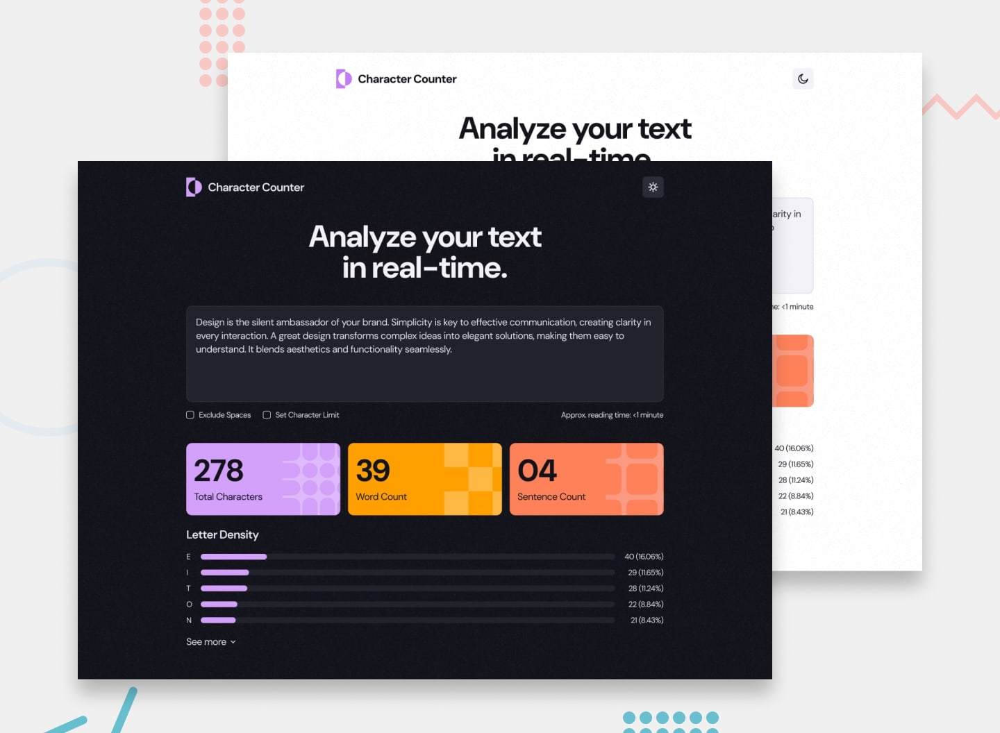

# Frontend Mentor - Character counter solution

This is a solution to the [Character counter challenge on Frontend Mentor](https://www.frontendmentor.io/challenges/character-counter-znSgeWs_i6). Frontend Mentor challenges help you improve your coding skills by building realistic projects. 

## Table of contents

- [Overview](#overview)
  - [The challenge](#the-challenge)
  - [Screenshot](#screenshot)
  - [Links](#links)
- [My process](#my-process)
  - [Built with](#built-with)
  - [What I learned](#what-i-learned)
  - [Continued development](#continued-development)
  - [Useful resources](#useful-resources)
- [Author](#author)


**Note: Delete this note and update the table of contents based on what sections you keep.**

## Overview

### The challenge

Users should be able to:

- Analyze the character, word, and sentence counts for their text
- Exclude/Include spaces in their character count
- Set a character limit
- Receive a warning message if their text exceeds their character limit
- See the approximate reading time of their text
- Analyze the letter density of their text
- Select their color theme
- View the optimal layout for the interface depending on their device's screen size
- See hover and focus states for all interactive elements on the page

### Screenshot




### Links

- Solution URL: [Github](https://github.com/DmytroVoitovych/Character-Counter)
- Live Site URL: [Live Page](https://dmytrovoitovych.github.io/Character-Counter/)

## My process

### Built with

- Semantic HTML5 markup
- CSS custom properties
- Flexbox
- CSS Grid
- Mobile-first workflow
- [React](https://reactjs.org/) - JS library
- [Anime.js](https://nextjs.org/) - Animation library

### What I learned

Working on this task allowed me to gain a deeper understanding of regular expressions. I focused on identifying optimal patterns for sentence and word detection that would work across multiple languages. Additionally, I discovered valuable CSS properties such as interpolate-size, which significantly enhances animation possibilities and provides more flexible control over dynamic content sizing. 

My variant to create letters list, see below:

```js
// Function analyzes text character frequency and renders statistics
const setStatistic = (text, renderFunction, outerEl) => {
    // Extract only letter characters using Unicode-aware regex
    const onlyLetters = text.match(/\p{L}/gu);

    // Clear container and exit if no letters found
    if(!onlyLetters?.length){ 
        outerEl.hasChildNodes() && outerEl.replaceChildren();
        return;
    }
        
    const arrForRender = [];
  
    // Count frequency of each letter (case-insensitive)
    const firstInteration = onlyLetters.reduce((acc, e) => {
      acc[e.toUpperCase()] = (acc[e.toUpperCase()] || 0) + 1;
      return acc;
    }, {});
  
    // Format data with letter, count and percentage
    for (const key in firstInteration) {
       arrForRender.push({
          letter: key,
          amount: firstInteration[key],
          percent: `(${((100 * firstInteration[key]) / onlyLetters.length).toFixed(2)}%)`,
       });
    }

    // Sort by frequency (highest first) and render results
    const readyList = arrForRender.toSorted((a,b) => b.amount - a.amount);
    renderFunction(readyList, outerEl, btnShow);
};
```

### Continued development

For my upcoming projects, I plan to explore server-side frameworks since they're generating significant buzz in the development community.


### Useful resources

- [Animate to height](https://developer.chrome.com/docs/css-ui/animate-to-height-auto) - Good article where you can finde more about future animation
- [Regex tester](https://regex101.com) - Good platform to teset regular exspression.


## Author

- Website - [Dmytro Voitovych](https://portfolio-dmytrovoitovych.vercel.app/)
- Frontend Mentor - [@dmytrovoitovych](https://www.frontendmentor.io/profile/DmytroVoitovych)


